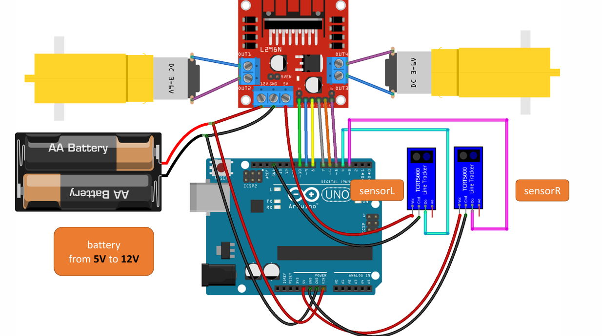

# Arduino Line Follower Robot

This project demonstrates a line follower robot using Arduino and line sensors.

## Components
- Arduino UNO
- Motor Driver (L298N)
- DC Motors
- Line Sensors

## Description
The line follower robot uses two sensors to detect a line on the ground and adjusts its movement to stay on the line. The robot's movement is controlled as follows:
- Moves forward when both sensors detect the line.
- Turns right when only the left sensor detects the line.
- Turns left when only the right sensor detects the line.
- Stops when neither sensor detects the line.

## Circuit

